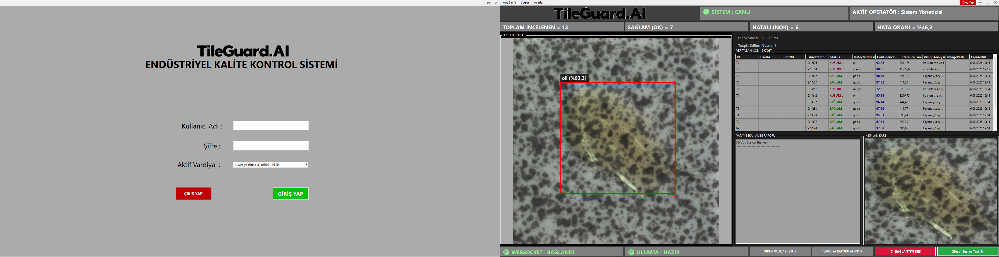

# TileGuard AI - Endüstriyel Fayans Kalite Kontrol Sistemi

TileGuard AI, endüstriyel fayans üretim hatlarında yüzey kusurlarını gerçek zamanlı olarak tespit eden ve yapay zekâ destekli hibrit mimarisiyle detaylı analiz sunan uçtan uca bir kalite kontrol sistemidir.

Sistem; **YOLOv11 (ONNX Runtime)** ile yüksek hızlı nesne tespiti, **Llava Vision-Language Model (VLM)** ile kusurların akıllı analiz edilmesi, **FastAPI WebSocket** tabanlı asenkron haberleşme ve modern **C# WinForms** tabanlı operatör panelini tek bir mimaride bir araya getirir.

---

# Proje Durumu

**Mevcut Aşama:** Aktif Geliştirme / Beta Aşaması (MVP Tamamlandı)

Temel sistem mimarisi, yapay zekâ çıkarım boru hattı, ilişkisel veritabanı yapısı, yetkilendirme modülleri ve C# operatör paneli stabil bir şekilde çalışmaktadır. Sistem üzerindeki optimizasyonlar, model yanıt iyileştirmeleri ve arayüz geliştirmeleri aktif olarak devam etmektedir.

---

# Ekran Görüntüleri



---

# Özellikler

- Gerçek zamanlı fayans yüzey kusuru tespiti
- Hibrit Yapay Zekâ Boru Hattı (YOLOv11 + Llava VLM)
- ONNX Runtime ile yüksek performanslı çıkarım
- FastAPI WebSocket tabanlı asenkron iletişim ve anlık veri akışı
- Bounding Box ile otomatik kusur konumlandırma ve kırpma (ROI)
- Llava modeli ile akıllı kusur analizi ve raporlama
- PostgreSQL üzerinde ilişkisel denetim geçmişi, kullanıcı/vardiya takibi ve sistem loglama altyapısı
- Rol tabanlı kullanıcı yönetimi (Admin / Operatör)
- Modern C# WinForms operatör paneli

---

# Kullanılan Teknolojiler

| Kategori | Teknolojiler |
|----------|--------------|
| **Yapay Zekâ** | YOLOv11, ONNX Runtime, Llava VLM (Ollama) |
| **Backend** | Python, FastAPI, WebSocket, Uvicorn |
| **Görüntü İşleme** | OpenCV, Pillow |
| **Veritabanı** | PostgreSQL, Npgsql |
| **Masaüstü Arayüz** | C# WinForms (.NET), Modern UI Bileşenleri |
| **Dağıtım (Planlanan)** | Docker, Docker Compose |

---

# Sistem Mimarisi

```text
          Görüntü Kaynağı
    (Test Görselleri / Kamera)
                 │
                 ▼
      C# WinForms Operatör Paneli
                 │
   Base64 Görüntü Akışı (WebSocket)
                 │
                 ▼
       FastAPI Backend (Python)
                 │
                 ▼
      YOLOv11 (ONNX Runtime)
 Gerçek Zamanlı Kusur Tespiti
                 │
   ROI (Kusurlu Bölge) Kırpma
                 │
                 ▼
     Llava Vision-Language Model
      Ayrıntılı Kusur Analizi
                 │
                 ▼
 PostgreSQL Denetim Geçmişi & Loglar
                 │
                 ▼
 Sonuçların Operatör Paneline Gönderilmesi
    (Anlık Tablo Yenileme)
```

---

# Yapay Zekâ Boru Hattı

### Gerçek Zamanlı Kusur Tespiti

YOLOv11 modeli (ONNX Runtime ile optimize edilmiş), kamera veya test görsellerinde yüksek FPS ile çalışarak kusurları konum bilgisi (Bounding Box) ve güven skoruyla tespit eder.

### ROI (Region of Interest) Oluşturma

Yalnızca kusurlu bölgeler dinamik olarak kırpılarak Vision-Language Model'e aktarılır. Böylece gereksiz işlem yükü azaltılır.

### Vision-Language Analizi

Kırpılan kusur bölgesi, Ollama üzerinde çalışan Llava modeli tarafından analiz edilerek endüstriyel nitelikte ayrıntılı rapor oluşturulur.

### Veritabanı Senkronizasyonu

Elde edilen tüm veriler; kullanıcı, vardiya ve görsel yolu ilişkileriyle birlikte PostgreSQL veritabanına kaydedilir ve C# arayüzündeki **Son 15 Kayıt** tablosu anlık olarak güncellenir.

---

# Proje Yapısı

```text
TileGuard_AI/
├── docs/
│   └── images/
│
├── src/
│   ├── ai_engine/
│   │   ├── agents/
│   │   ├── api/
│   │   ├── models/
│   │   ├── pipeline/
│   │   ├── main.py
│   │   └── requirements.txt
│   │
│   └── operator_panel/
│       └── TileGuard.UI/
│           ├── DTOs/
│           ├── Helpers/
│           ├── Models/
│           ├── Resources/
│           ├── Services/
│           ├── Form1.cs
│           ├── LoginForm.cs
│           ├── HistoryForm.cs
│           └── ...
│
├── .gitignore
└── README.md
```

---

# Yol Haritası

## Tamamlanan Özellikler

- [x] YOLOv11 ile gerçek zamanlı kusur tespiti ve ONNX entegrasyonu
- [x] FastAPI backend ve WebSocket tabanlı asenkron görüntü aktarımı
- [x] C# WinForms operatör paneli ve dinamik veri gridleri
- [x] PostgreSQL ilişkisel veritabanı yapısı (Kullanıcılar, Vardiyalar, Denetim Geçmişi, Sistem Logları)
- [x] Llava VLM entegrasyonu ve akıllı pipeline
- [x] Rol tabanlı kullanıcı giriş ve yönetim panelleri

## Planlanan Özellikler

- [ ] Daha geniş veri setleri ile modelin fine-tune edilmesi
- [ ] Docker ve Docker Compose desteğinin eklenmesi
- [ ] Vardiya raporu PDF çıktı modülünün geliştirilmesi

---

# Kurulum

## Gereksinimler

- Python 3.10+
- .NET 6 veya üzeri
- PostgreSQL 16+
- Ollama (Llava modeli için)

---

## Llava Modelini Yükleyin

```bash
ollama run llava
```

---

## Backend Kurulumu

```bash
cd src/ai_engine

python -m venv .venv

# Windows
.venv\Scripts\activate

pip install -r requirements.txt

python main.py
```

Sunucu varsayılan olarak:

```text
http://127.0.0.1:8000
```

adresinde çalışacaktır.

---

# PostgreSQL Veritabanı Kurulumu

PostgreSQL üzerinde veritabanınızı oluşturduktan sonra aşağıdaki SQL betiğini çalıştırarak tüm tabloları, ilişkileri, indeksleri ve örnek başlangıç verilerini oluşturabilirsiniz.

```sql
-- 1. KULLANICILAR / OPERATÖRLER TABLOSU
CREATE TABLE IF NOT EXISTS users (
    user_id SERIAL PRIMARY KEY,
    username VARCHAR(50) UNIQUE NOT NULL,
    password_hash VARCHAR(255) NOT NULL,
    full_name VARCHAR(100) NOT NULL,
    role VARCHAR(20) DEFAULT 'Operator',
    is_active BOOLEAN DEFAULT TRUE,
    created_at TIMESTAMP DEFAULT CURRENT_TIMESTAMP
);

-- 2. VARDİYA TANIMLARI TABLOSU
CREATE TABLE IF NOT EXISTS shifts (
    shift_id SERIAL PRIMARY KEY,
    shift_name VARCHAR(50) NOT NULL,
    start_time TIME NOT NULL,
    end_time TIME NOT NULL,
    is_active BOOLEAN DEFAULT TRUE
);

-- 3. DENETİM GEÇMİŞİ TABLOSU
CREATE TABLE IF NOT EXISTS inspection_history (
    id SERIAL PRIMARY KEY,
    timestamp VARCHAR(50),
    status VARCHAR(20),
    detected_class VARCHAR(50),
    confidence DOUBLE PRECISION,
    inference_time_ms DOUBLE PRECISION,
    vision_analysis TEXT,
    created_at TIMESTAMP DEFAULT CURRENT_TIMESTAMP,
    user_id INT REFERENCES users(user_id) ON DELETE SET NULL,
    shift_id INT REFERENCES shifts(shift_id) ON DELETE SET NULL,
    image_path VARCHAR(255)
);

-- 4. PERFORMANS İÇİN İNDEKSLER
CREATE INDEX IF NOT EXISTS idx_inspection_status ON inspection_history(status);
CREATE INDEX IF NOT EXISTS idx_inspection_created_at ON inspection_history(created_at);
CREATE INDEX IF NOT EXISTS idx_inspection_user_shift ON inspection_history(user_id, shift_id);

-- 5. SİSTEM LOGLARI TABLOSU
CREATE TABLE IF NOT EXISTS system_logs (
    log_id SERIAL PRIMARY KEY,
    log_level VARCHAR(50) NOT NULL,
    message TEXT NOT NULL,
    stack_trace TEXT,
    created_at TIMESTAMP DEFAULT CURRENT_TIMESTAMP
);

-- 6. ÖRNEK BAŞLANGIÇ VERİLERİ
INSERT INTO shifts (shift_name, start_time, end_time) VALUES
('1. Vardiya (Gündüz)', '08:00:00', '16:00:00'),
('2. Vardiya (Akşam)', '16:00:00', '00:00:00'),
('3. Vardiya (Gece)', '00:00:00', '08:00:00')
ON CONFLICT DO NOTHING;

INSERT INTO users (username, password_hash, full_name, role) VALUES
('operator_ornek', 'sifre123', 'Örnek Operatör', 'Operator'),
('admin_ornek', 'admin123', 'Sistem Yöneticisi', 'Admin')
ON CONFLICT DO NOTHING;
```

---

# Operatör Paneli

Visual Studio ile çözüm dosyasını açın.

```text
src/operator_panel/TileGuard.UI/TileGuard.UI.sln
```

Ardından projeyi derleyin (**Build Solution**) ve çalıştırın.

---

# Sonuç

TileGuard AI; nesne tespiti ile modern Vision-Language Model teknolojilerini endüstriyel otomasyonla buluşturan, yüksek performanslı ve ölçeklenebilir bir akıllı kalite kontrol platformudur.